# 离岸信托个人所得税傻瓜书

>基于 [财政部 税务总局关于离岸信托个人所得税有关事项的公告（财政部 税务总局公告2026年第21号](https://hainan.chinatax.gov.cn/xxgk_6_1/24166170.html)

> **GAAS 智能管理平台 · 海外信托个税** 从零到申报缴款的全程手把手操作手册。
> 本文所有截图与数字都来自 **2026-09-19 的一次真实完整操作**（示例库 `gaas_demo`），
> 以两份模拟底稿为输入：
>
> - `离岸信托文档/离岸信托_01_保留控制型信托涉税底稿.xlsx`
> - `离岸信托文档/离岸信托涉税文件汇编001.xlsx`
>
> 你只要按本文顺序点鼠标，就能把这轮业务完整走一遍，最后得到 2 张申报单、合计应缴
> **15,595,456.00 元**，并登记缴款、结清台账。

---

## 0. 三分钟看懂这份文档

### 0.1 谁需要做什么

| 角色 | 账号（示例） | 干什么 |
|---|---|---|
| 运维 | — | 启动服务、设定集群 Master 口令（见 §1） |
| 管理员 admin | `admin` / `admin` | 建库、建用户、登记汇率 |
| 专员 clerk1 | `clerk1@demo.local` / `clerk123` | 上传附件、AI 解析、核对草稿 |
| 主管 manager1 | `manager1@demo.local` / `manager123` | 审核事件、聚合计算、生成申报、登记缴款 |

> ⚠ **最容易踩的坑**：登录框里的「账号」填的是**邮箱**（`clerk1@demo.local`），
> **不是**用户名（`clerk1`）。填用户名会提示「账号不存在」。

### 0.2 全流程一张图

```
第一~三步  登录 → 建库 → 认识门面
第四~六步  建用户 → 建申报人 → 登记外币汇率      ← 汇率必须先登记
第七~八步  上传附件 → AI 解析生成草稿
第九~十步  专员逐条核对草稿 → 主管审核（草稿 → 已审核）
第十一~十四步 聚合计算 → 生成申报 → 登记缴款 → 台账/归档
```

### 0.3 每一步的验收点

| 步骤 | 做完之后你应该看到 |
|---|---|
| §2 登录 | 进入「应用门面」dashboard |
| §3 建库 | 数据库列表出现「海外信托个税演示库 / gaas_demo」 |
| §5 建用户 | 用户列表共 3 人（admin、clerk1、manager1） |
| §6 建申报人 | 申报人列表共 1 人「马杰克」 |
| §7 登记汇率 | 汇率管理出现 3 条 USD 汇率 |
| §8 上传附件 | 附件区 2 个文件 |
| §9 AI 解析 | 草稿区出现 8 条草稿 |
| §10 核对草稿 | 每条草稿都能打开「详细」并保存 |
| §11 主管审核 | 8 条草稿全部变为「已审核」 |
| §12 聚合计算 | 应纳税额合计 15,595,456.00 元 |
| §13 生成申报 | 申报管理出现 2 张申报单 |
| §14 登记缴款 | 两张申报单都显示「全部缴纳」 |
| §15 台账归档 | 缴款管理可查到 2 条缴款记录 |

---

## 1. 准备：把服务跑起来（运维做一次）

```bash
# 1) 启动数据库
sudo pg_ctlcluster 16 main start

# 2) 启动服务（注意：必须用 --bin gaas-server 指定二进制）
cd gaas_topcast_base
GAAS_MASTER_PASSWORD='Master2026!' \
  cargo run -p gaas-server --bin gaas-server -- --config conf/c.toml

# 3) 看到下面这行就说明起来了
#    INFO gaas_server: gaas 基础框架 http://127.0.0.1:6080
```

要点：

1. **集群 Master 口令**（本文示例 `Master2026!`）用于「创建/备份/删除数据库」。
   它属于**平台安全职责**，与租户里的 admin 身份完全分离——admin 不能建库/删库。
   本文用环境变量 `GAAS_MASTER_PASSWORD` 静态指定，重启后仍然有效；
   若未指定，系统会随机生成并在**首次安装页 `/setup` 只显示一次**。
2. 服务只监听 `127.0.0.1:6080`，浏览器打开 <http://127.0.0.1:6080/> 即可。
3. 数据库连接配置在 `gaas_topcast_base/conf/c.toml`（本机 `127.0.0.1:5432`，
   库 `gaas_boot`）。会话签名密钥 `.sesskey` 会自动生成在配置文件同目录。

---

## 2. 第一步：打开平台并登录

浏览器访问 <http://127.0.0.1:6080/>，会看到统一登录入口。

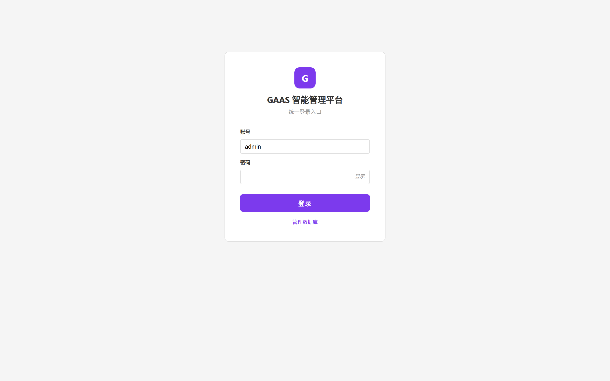

- 「数据库」下拉：当平台有 ≥2 个数据库时出现，选择要进入的库；
- 「账号」：填**邮箱**（管理员默认 `admin`）；
- 「管理数据库」：进入数据库生命周期管理（需要 Master 口令）。

---

## 3. 第二步：创建演示数据库（只需一次）

> 已经有可用数据库的可跳过本节，直接登录已有库。

### 3.1 通过 Master 门禁

点登录页下方「管理数据库」，或直接访问 <http://127.0.0.1:6080/master/databases>。
出于安全考虑，**未授权时页面只显示口令输入框，不泄露任何库列表**：

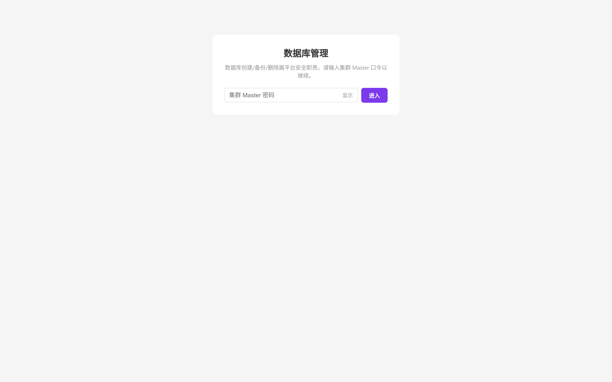

输入集群 Master 口令（示例 `Master2026!`）→ 点「进入」。

### 3.2 填写并提交建库表单

进入后可以看到「数据库实例」「创建数据库」「备份文件」「Master 密码重置」四块：

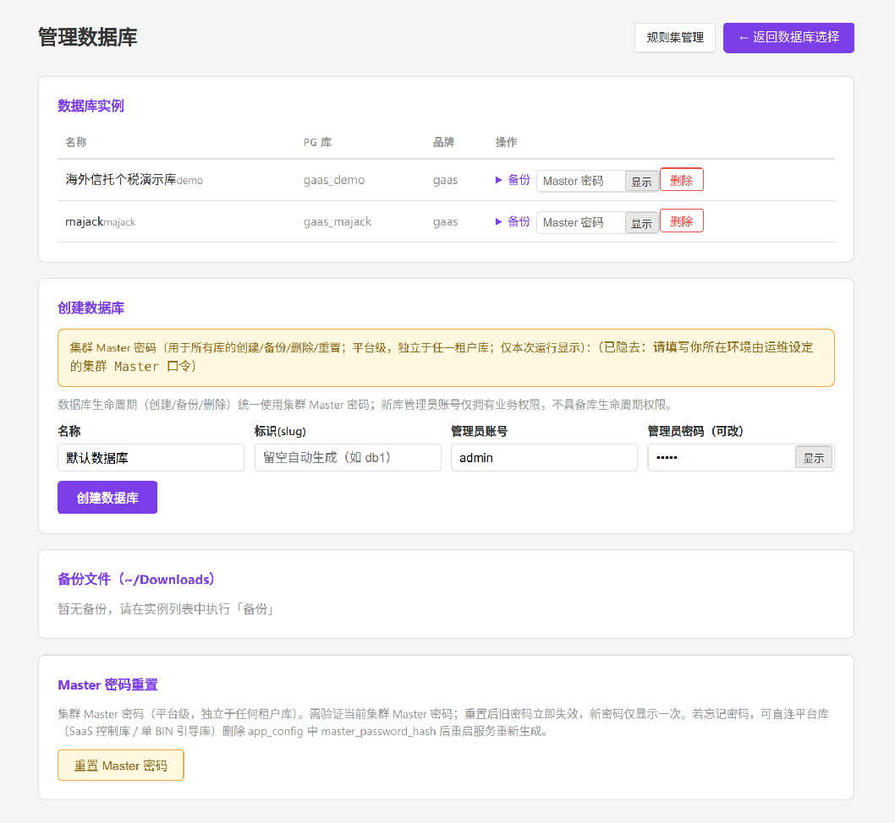

在「创建数据库」里填四项，然后点「创建数据库」：

| 字段 | 本文示例值 | 说明 |
|---|---|---|
| 名称 | 海外信托个税演示库 | 显示名，可中文 |
| 标识(slug) | demo | 小写字母/数字/下划线，决定物理库名 `gaas_demo` |
| 管理员账号 | admin | 新库的管理员登录账号 |
| 管理员密码（可改） | admin | 新库管理员密码 |

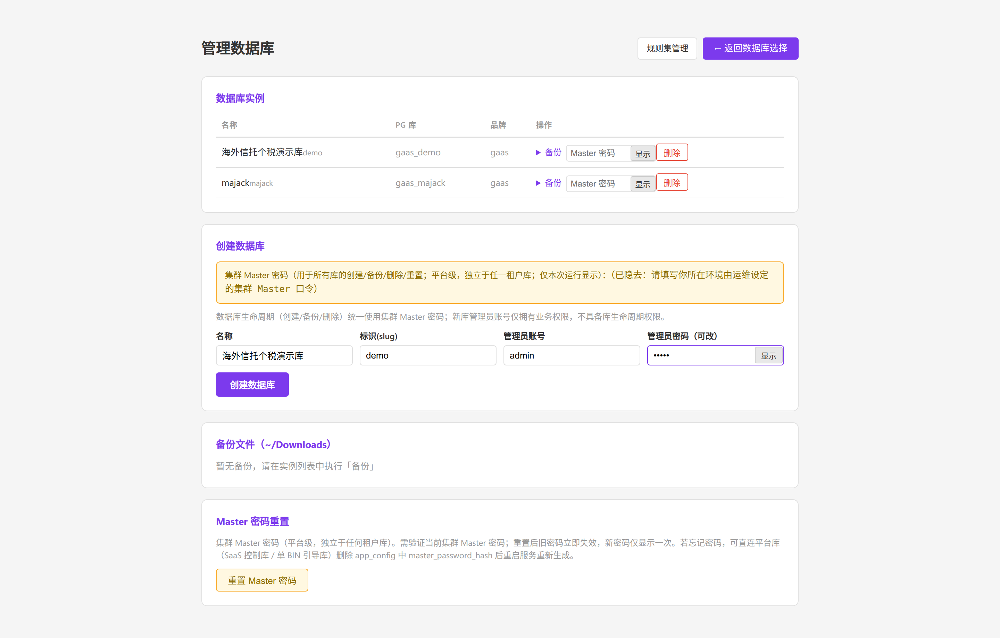

> 截图中的集群 Master 口令已隐去——请填你所在环境由运维设定的口令。

提交后系统会：创建物理库 `gaas_<slug>` → 建全部业务表 → 写入默认品牌 →
在新库内创建管理员用户 → **回到登录页**（不会自动登录新库，这是刻意设计，
避免新库成为其他库管理页的「控制上下文」）。

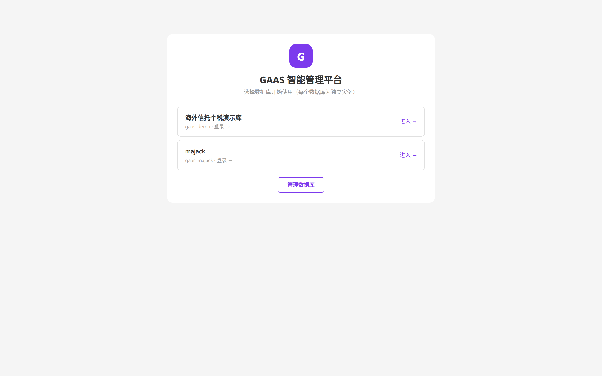

---

## 4. 第三步：登录并认识门面

在登录页选择「海外信托个税演示库」，账号 `admin` / 密码 `admin` 登录，
进入**应用门面（dashboard）**：

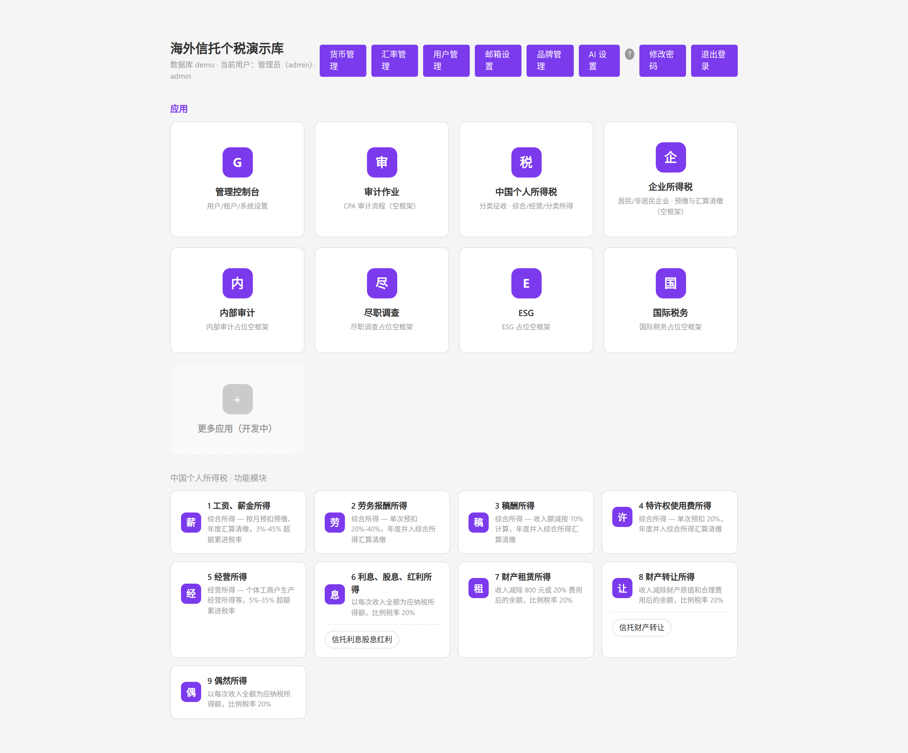

门面按《个人所得税法》分类征收分层摆放：

1. 顶层：管理控制台 / 审计作业 / **中国个人所得税** / 企业所得税 / 内部审计 / 尽职调查 / ESG / 国际税务；
2. 中间：中国个税九类所得（1 工资薪金 … 9 偶然所得）；
3. 本业务入口：分类所得 **6 利息股息红利** 与 **8 财产转让** 下的
   「**信托利息股息红利**」`/trusts?kind=dividend` 与「**信托财产转让**」`/trusts?kind=transfer`。

> 记住：本系统的主线是「**人 → 事件 → 税**」，所以所有业务都从**申报人**开始，
> 不是从「信托」开始。

---

## 5. 第四步：创建操作账号（管理员）

### 5.1 打开用户管理

门面右上角头像 → 管理控制台 → **用户管理**，或直接访问 <http://127.0.0.1:6080/admin/users>。

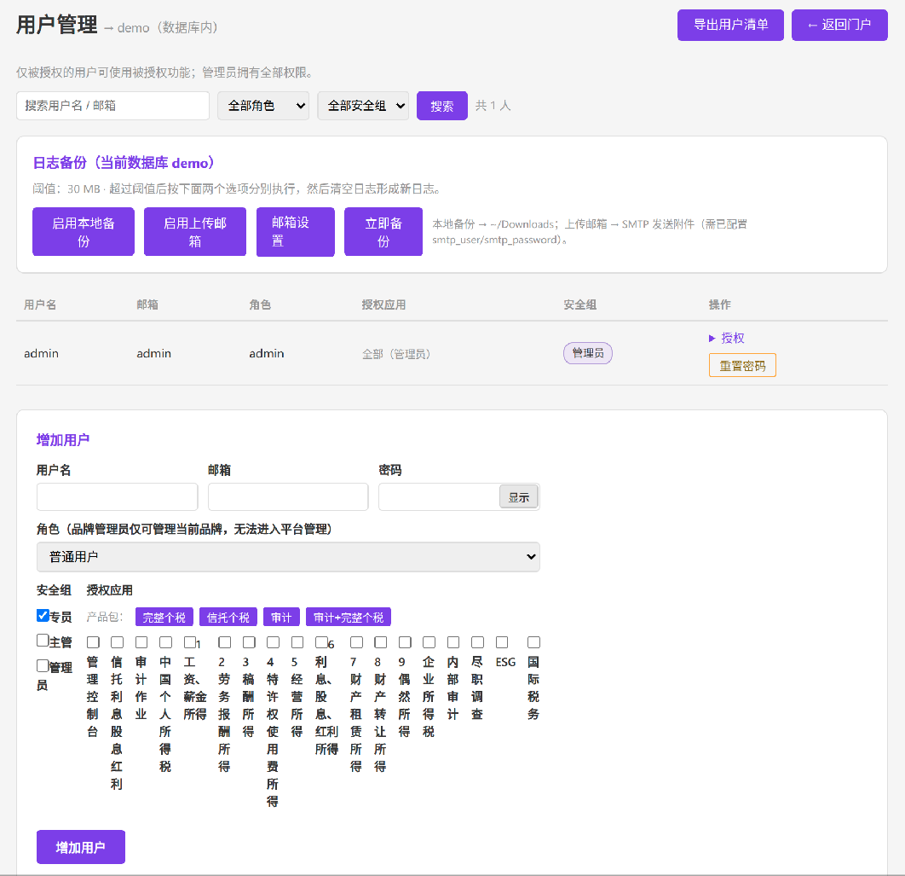

### 5.2 建专员（能建草稿、不能审核）

在页面底部「增加用户」区填写，然后点「增加用户」：

| 字段 | 值 |
|---|---|
| 用户名 | clerk1 |
| 邮箱 | clerk1@demo.local |
| 密码 | clerk123 |
| 角色 | 普通用户 |
| 安全组 | ☑ 专员（默认已勾选） |
| 授权应用 | 勾「信托个税」产品包（或单独勾「信托利息股息红利」） |

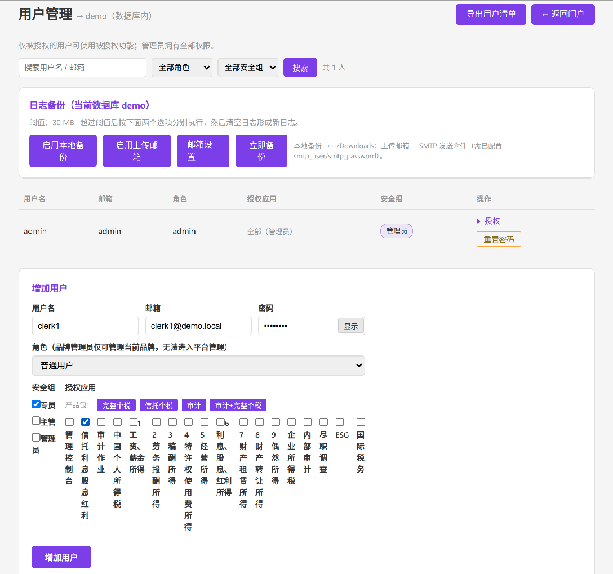

### 5.3 建主管（能审核、能聚合、能申报）

同样方式再建一个，安全组同时勾「专员」和「主管」：

| 字段 | 值 |
|---|---|
| 用户名 | manager1 |
| 邮箱 | manager1@demo.local |
| 密码 | manager123 |
| 安全组 | ☑ 专员 ☑ 主管 |
| 授权应用 | 勾「信托个税」 |

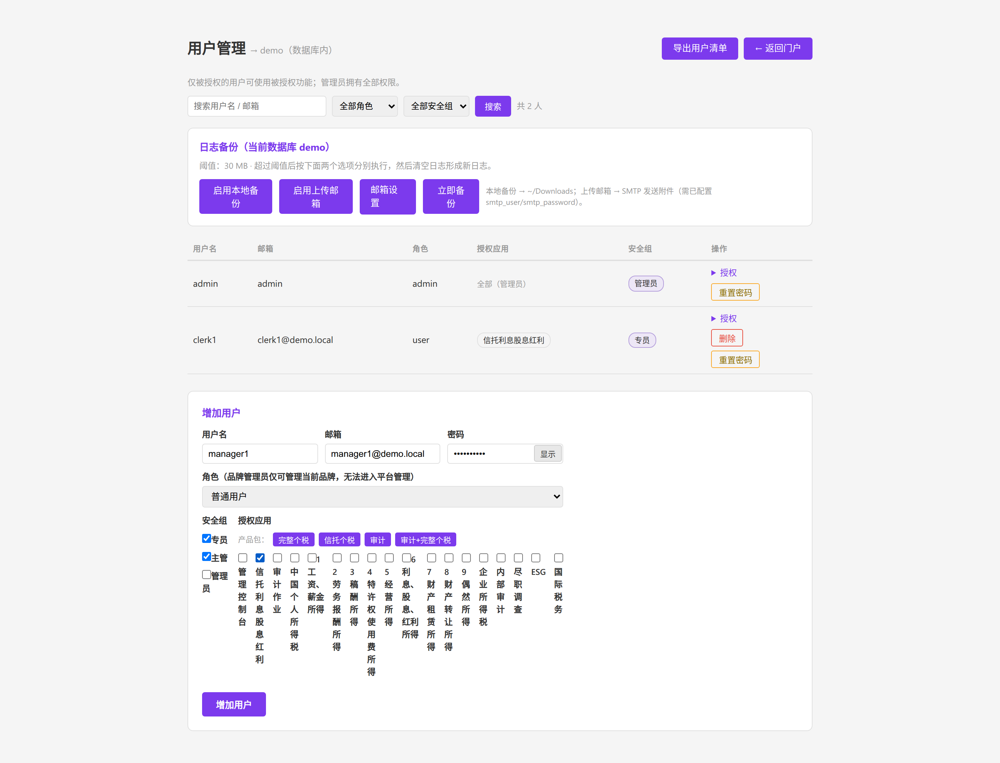

建完后回到列表核对三个人都在，且「授权应用」不是「全部」：

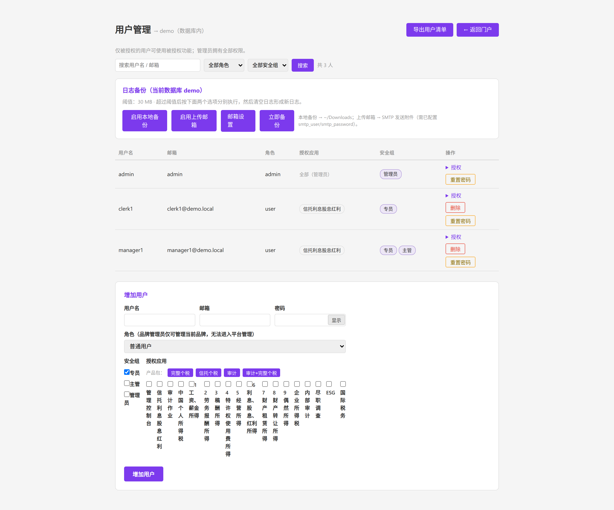

> 权限小抄：**专员 = 录入/保存草稿**；**主管 = 审核/聚合/申报/缴款**；**管理员 = 全部 + 建库建用户**。

---

## 6. 第五步：创建申报人（管理员）

1. 门面进入「信托利息股息红利」→ 申报人列表；或直接访问 <http://127.0.0.1:6080/trusts>；
2. 点「创建申报人」；
3. 填表：

| 字段 | 本文示例值 |
|---|---|
| 姓名 | 马杰克 |
| 纳税人身份 | 居民个人 |
| 纳税证件名称 | 居民身份证 |
| 纳税证件号码 | 110101199001011234 |

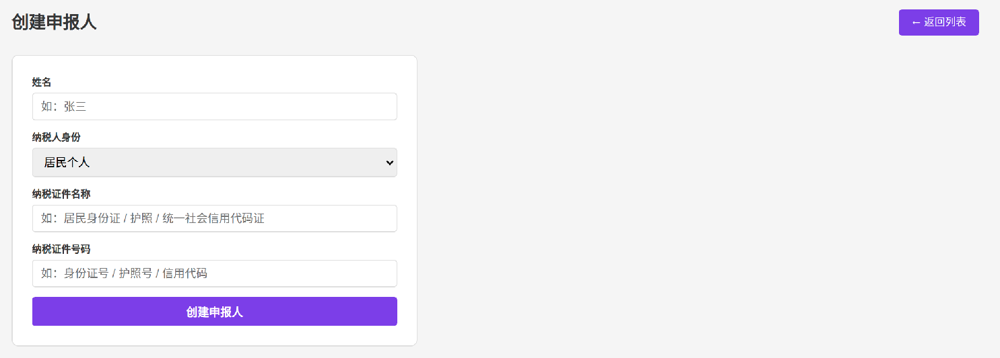

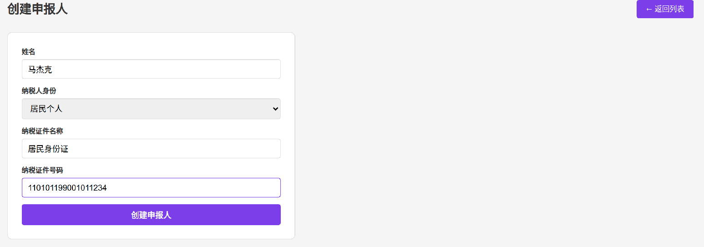

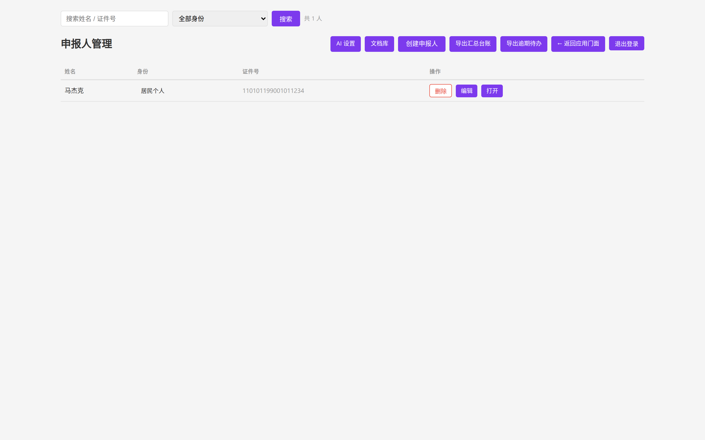

点「打开」进入**申报人详情页**，这是本系统的工作台——事件列表、草稿区、
聚合计算、申报区域、缴纳税款、附件、我的份额都在这一个页面上：

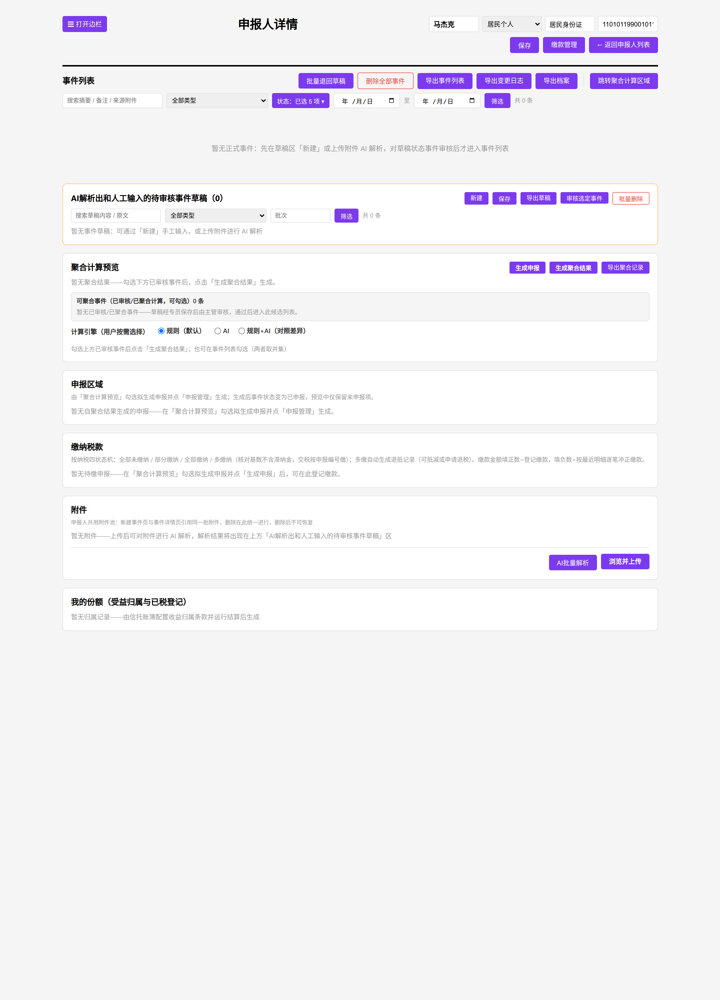

> 页面标头左侧「☰ 打开边栏」可以快速跳转到各区域：
> 事件列表 / 草稿区 / 聚合计算 / 申报区域 / 缴纳税款 / 附件 / 我的份额。

---

## 7. 第六步：先登记外币汇率（重要顺序！）

**为什么必须先做**：AI 解析外币事件时，汇率**只能**来自「汇率管理」登记表。
没登记 → 系统把人民币金额一律置空（不猜测），草稿会带黄色「⚠需核对」标记。
先登记汇率，解析结果才完整。

1. 门面右上角 → **汇率管理**（<http://127.0.0.1:6080/fx-rates>）；
2. 逐条登记，点「添加/更新」：

| 日期 | 币种 | 汇率 | 来源 |
|---|---|---|---|
| 2024-12-31 | USD 美元 | 7.0984 | 国家税务总局 2024-12-31 中间价 |
| 2025-12-31 | USD 美元 | 7.10 | 国家税务总局 2025-12-31 中间价 |
| 2026-12-31 | USD 美元 | 7.15 | 演示用假定汇率 |

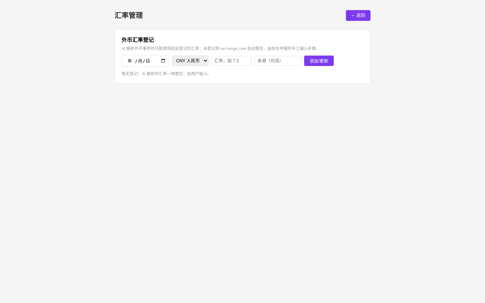

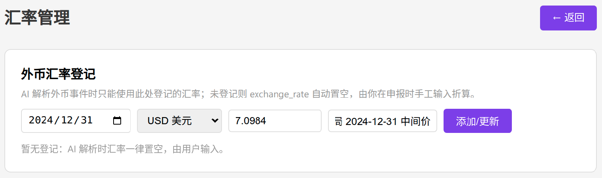

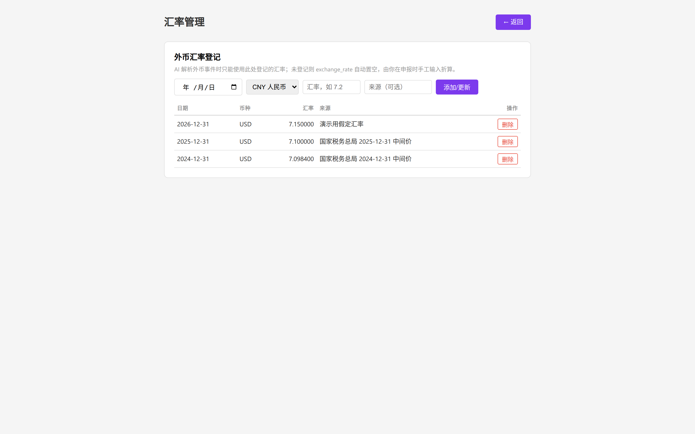

---

## 8. 第七步：上传附件（专员）

1. 用 `clerk1@demo.local` / `clerk123` 登录（**注意填邮箱**）；
2. 进入「信托利息股息红利」→ 打开申报人「马杰克」；
3. 滚到页面下方「**附件**」区，点「**浏览并上传**」，选择
   `离岸信托_01_保留控制型信托涉税底稿.xlsx`；
4. 上传完成后重复一次，选择 `离岸信托涉税文件汇编001.xlsx`。

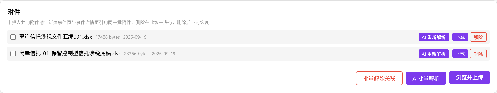

上传机制小抄：同名/同内容（MD5 相同）的文档**只存一份**，
申报人页面上的附件是「引用」；被事件引用的文档禁止物理删除，只能「解除关联」。

---

## 9. 第八步：AI 解析生成草稿（专员）

1. 勾选两个附件左侧的复选框；
2. 点「**AI批量解析**」。

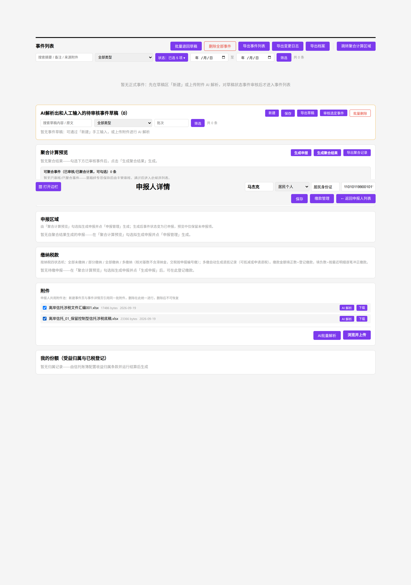

3. 系统进入**批量解析任务页**，每 3 秒自动刷新。LLM 调用通常几十秒到几分钟：

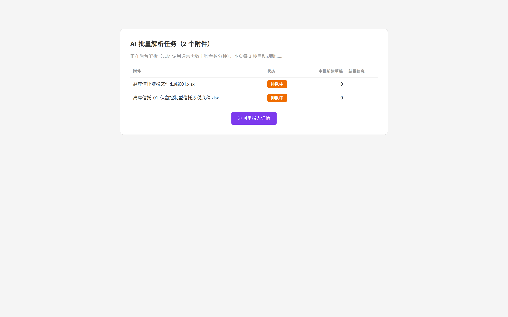

4. 全部完成时，每一行都会给出「本批新建草稿」条数：

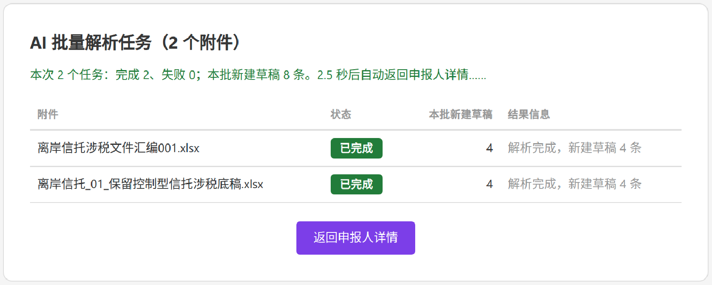

5. 点「返回申报人详情」，草稿区已经出现 8 条草稿
   （本轮实测：汇编 001 解析出 5 条、底稿 01 解析出 3 条）：


### 9.1 本轮 AI 解析出的 8 条草稿

下表按草稿生成顺序列出，「编号」是系统内部的事件编号（草稿区不显示它，
但 §11.2 的拦截提示和事件详情页地址用的就是它）。

| 编号 | 事件类型 | 事件日期 | 来源 | 原币金额 | 汇率 | 人民币口径金额 | 应纳税额 |
|---|---|---|---|---|---|---|---|
| 9 | 居民个人将财产装入离岸信托（第三条第一款） | 2024-06-15 | 汇编 001 | —（人民币计价） | — | 29,700,000 | 5,940,000 |
| 10 | 存续期利息股息红利（第四条第一款） | 2024-12-31 | 汇编 001 | 1,200,000 USD | 7.0984 | 8,518,080 | 1,703,616 |
| 11 | 存续期利息股息红利（第四条第一款） | 2024-12-31 | 汇编 001 | 500,000 USD | 7.0984 | 3,549,200 | 709,840 |
| 12 | 存续期利息股息红利（第四条第一款） | 2025-12-31 | 汇编 001 | 1,500,000 USD | 7.10 | 10,650,000 | 2,130,000 |
| 13 | 存续期利息股息红利（第四条第一款） | 2025-12-31 | 汇编 001 | −200,000 USD | 7.10 | −1,420,000 | 0 |
| 14 | 居民个人将财产装入离岸信托（第三条第一款） | 2025-03-10 | 底稿 01 | —（人民币计价） | — | 17,750,000 | 3,550,000 |
| 15 | 存续期利息股息红利（第四条第一款） | 2025-12-31 | 底稿 01 | 800,000 USD | 7.10 | 5,680,000 | 1,136,000 |
| 16 | 存续期利息股息红利（第四条第一款） | 2025-12-31 | 底稿 01 | 300,000 USD | 7.10 | 2,130,000 | 426,000 |

> 两条「装入」事件是**人民币计价的视同财产转让**：
> 编号 9 = 4500 万 − 1500 万 − 30 万 = 2970 万 → 税 594 万；
> 编号 14 = 2600 万 − 800 万 − 25 万 = 1775 万 → 税 355 万。
> 外币事件的人民币金额 = 原币金额 × 登记汇率。

### 9.2 为什么有些行是浅黄色？

浅黄行 = 该草稿带 `_ai_flags`（AI 推测/缺失字段标记），来源是系统的**防编造机制**：

| 层级 | 机制 | 效果 |
|---|---|---|
| L1 | 汇率必须命中登记表 | 未登记 → 删除 AI 猜的汇率并标记 |
| L2 | 金额必须能在附件原文找到数字锚点 | 找不到 → 保留但标记「⚠需核对」 |
| L3 | 带标记草稿**禁止批量一键审核** | 必须逐条打开核对 |

所以看到黄底不要慌——它表示「这里必须人看一眼」，这正是合规系统该有的样子。

---

## 10. 第九步：专员逐条核对草稿

对每一条草稿：

1. 草稿行右侧点「**详细**」；
2. 打开「AI 辅助 — 事件数据预览」页，核对**事件日期、税目、原币金额、汇率、
   市场价值/财产原值/合理费用、备注**，并对照右侧的「**附件原文摘要**」；
3. 需要修改直接改输入框；确认无误后点右上角「**保存草稿**」。

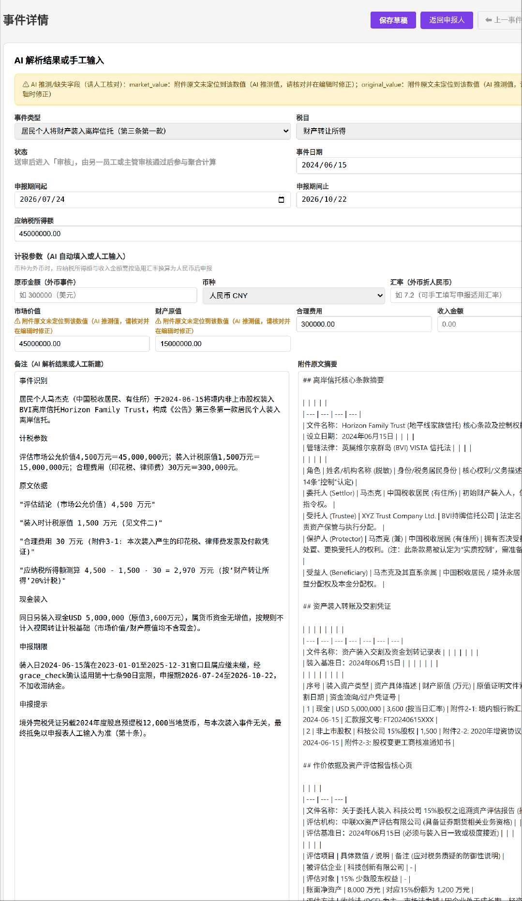

保存后会回到申报人详情页，并提示：

> 草稿已保存（仍为草稿）：专员确认后的 AI 结果已写入，**请由主管在草稿区审核后进入正式事件**

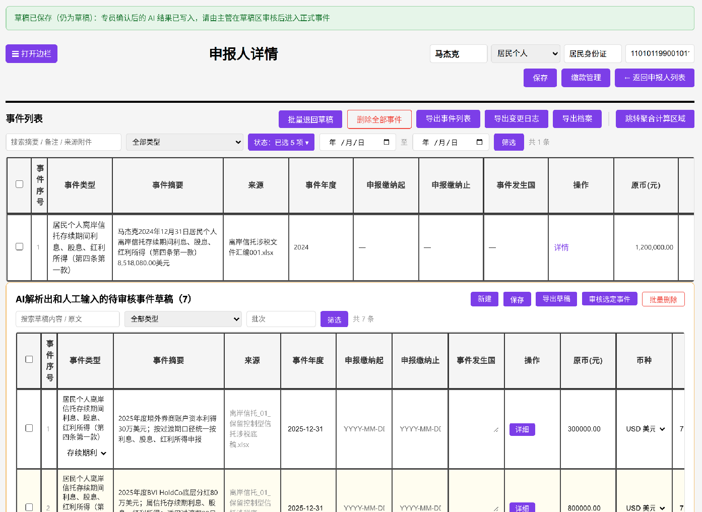

> 设计说明：**专员保存 ≠ 审核**。草稿状态不变，审核是主管的动作，形成「两次人工确认」。

---

## 11. 第十步：主管审核（草稿 → 已审核）

用 `manager1@demo.local` / `manager123` 登录，打开同一个申报人。

### 11.1 情况一：草稿没有 ⚠ 标记 → 批量审核

勾选这些草稿 → 点「**审核选定事件**」→ 确认 → 提示「已审核通过 N 个事件草稿
（进入审核通过·待聚合）」。

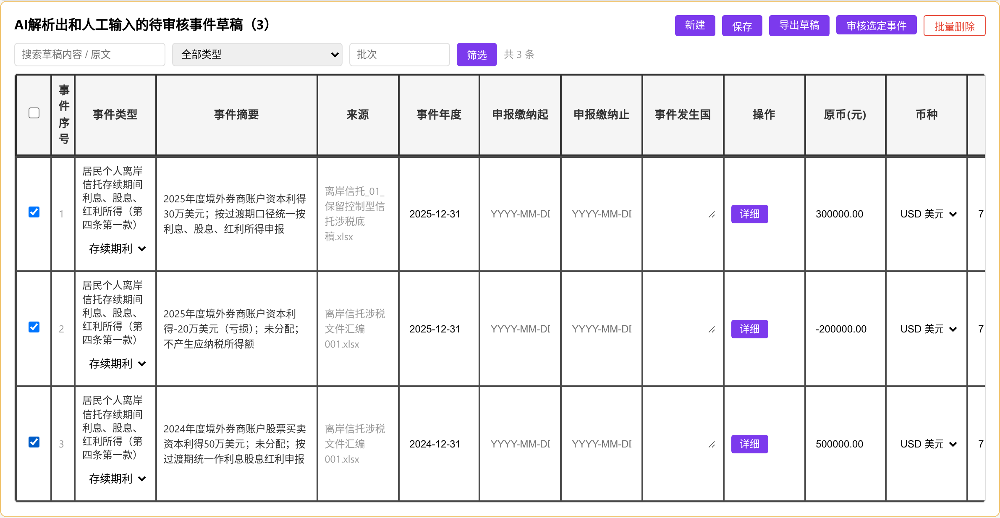

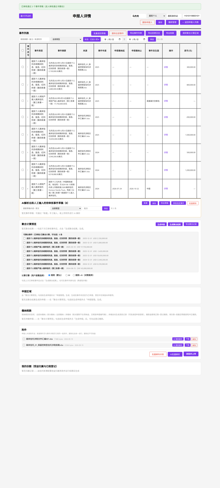

### 11.2 情况二：草稿带 ⚠ 标记 → 系统会拦你一下

如果勾选里含有带标记的草稿，系统**拒绝**批量审核：

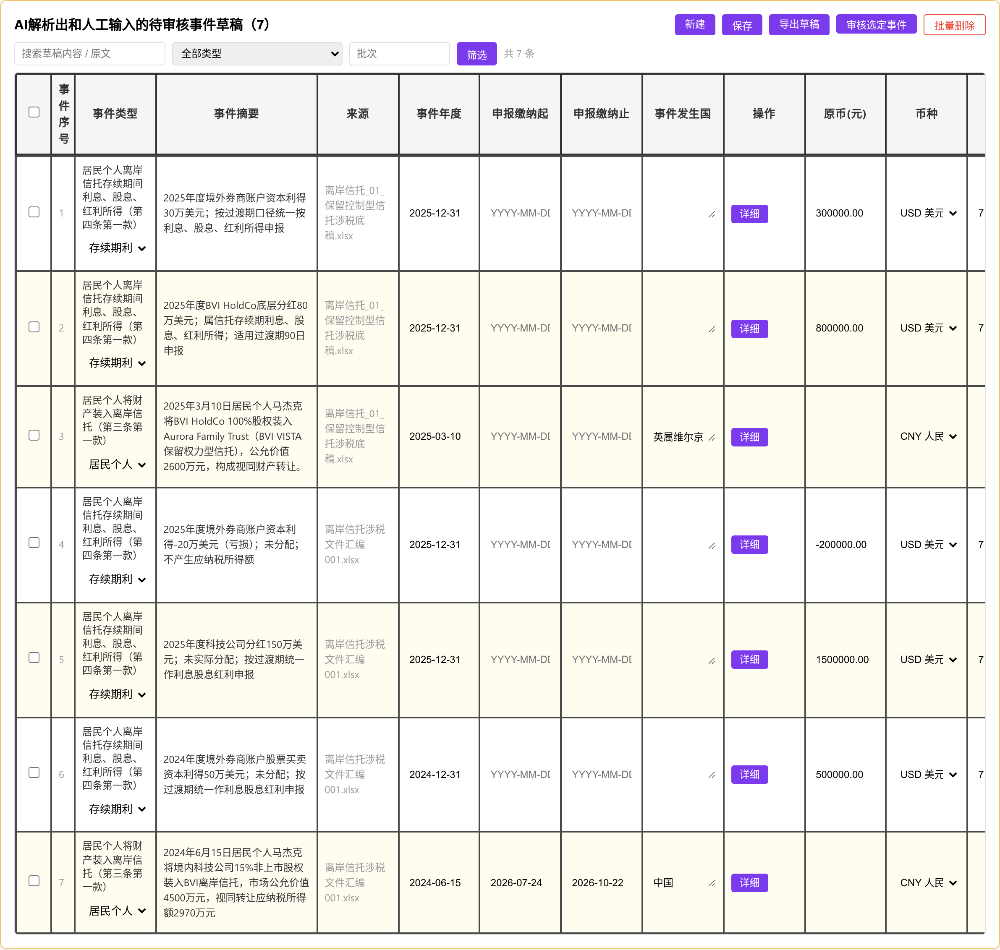

> 事件 15,14,12,9 含 AI 推测/缺失字段（如汇率未登记、金额无附件依据），
> 已阻止批量审核；请逐条打开核对后再操作

这不是报错，是**护栏**。提示里的数字就是这些草稿的**事件编号**，按下面方式逐条审核：

1. 打开该事件的详情页：把申报人详情页地址末尾加上 `/events/事件编号`，
   例如 `http://127.0.0.1:6080/trusts/<申报人ID>/events/9`；
2. 页面顶部是五态进度条（草稿 → 已审核 → 已聚合计算 → 已申报 → 纳税状态），
   下方「申报人 / 事件类型 / 应纳税所得额 / 汇率 / 应纳税额」等字段可逐项核对：

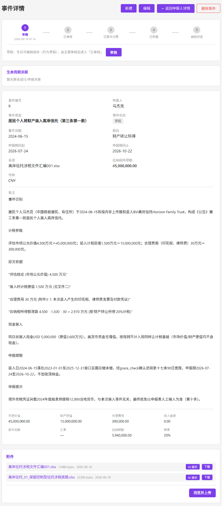

3. 点「**审核**」→ 确认 → 进度条第 2 步变成 ✓ 绿色，状态「已审核（待聚合）」
   并记录审核人与时间：

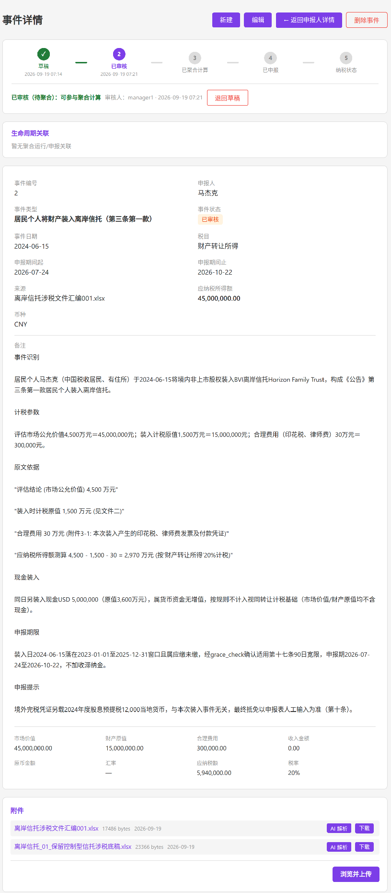

4. 对其余带标记草稿重复上述操作；
5. 回到申报人详情页勾选剩下**没有标记**的草稿 → 「审核选定事件」批量通过。

完成后草稿区数量归零、事件列表出现 8 条正式事件：

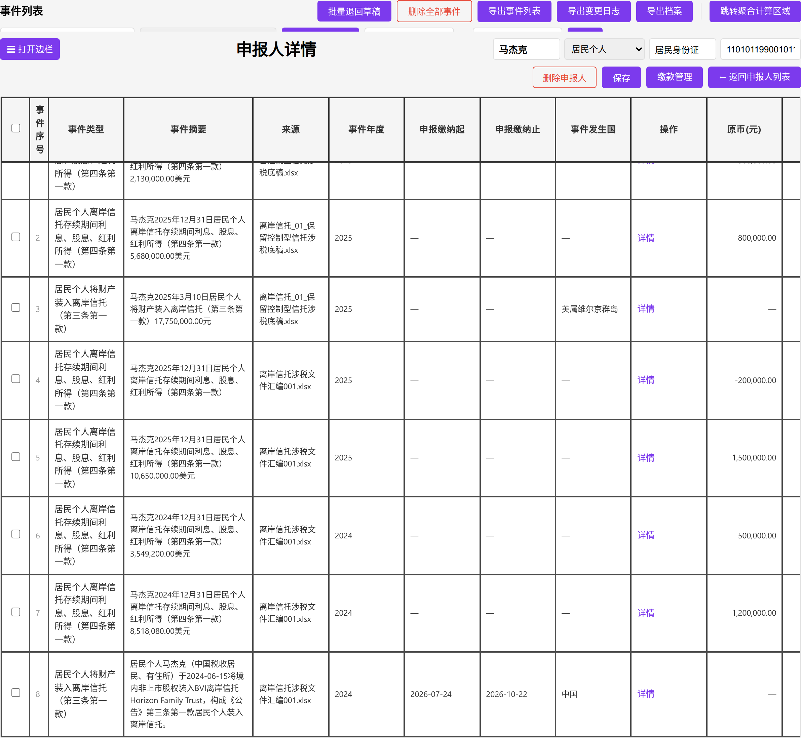

---

## 12. 第十一步：聚合计算

**聚合口径**：同一申报人 + 同一**申报缴纳期间**的事件汇总成一张申报单。

1. 在申报人详情页滚到「**聚合计算预览**」区；
2. 「计算引擎」保持默认「**规则（默认）**」；
3. 勾选「可聚合事件（已审核/已聚合计算，可勾选）」里的 8 条事件；
4. 点「**生成聚合结果**」。

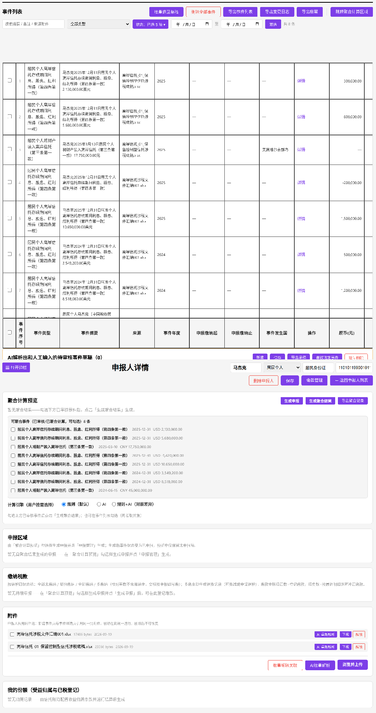

> 若提示「未勾选任何事件」，说明既没在聚合区勾，也没在事件列表勾（两处取并集）。

### 12.1 核对聚合结果

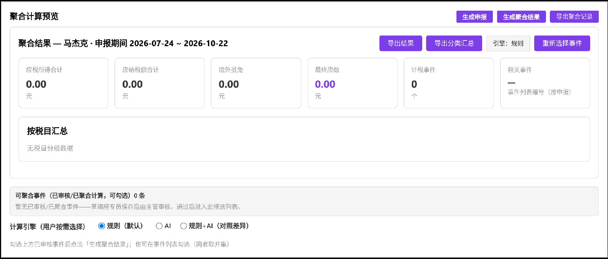

同一页面的整体视图（含上方事件列表、下方申报区域与附件区）如下，方便你确认各个区域的位置关系：

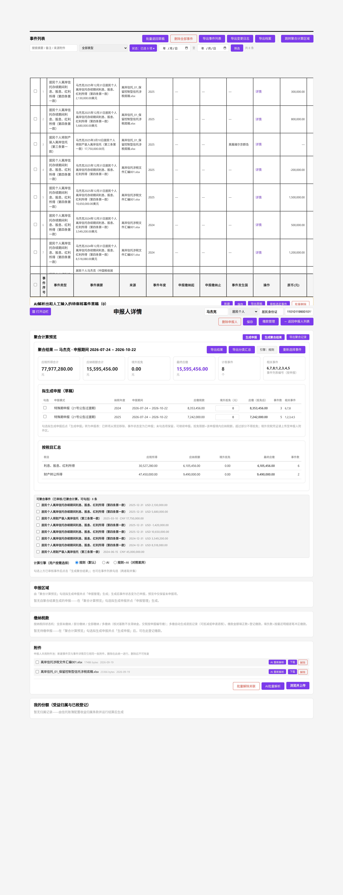

本轮实测结果（可与本文对账）：

| 指标 | 数值（元） |
|---|---|
| 应纳税所得额合计 | 77,977,280.00 |
| 应纳税额合计 | 15,595,456.00 |
| 境外抵免合计 | 0.00 |
| 最终应缴 | 15,595,456.00 |
| 计税事件 | 8 个 |

系统按申报期间自动拆成两张「拟生成申报（草稿）」：

| 申报模式 | 纳税年度 | 申报期间 | 应缴税款 | 相关事件（事件列表序号） |
|---|---|---|---|---|
| 特殊期申报（21 号公告过渡期） | 2024 | 2026-07-24 ~ 2026-10-22 | 8,353,456.00 | 6,7,8（界面序号） |
| 特殊期申报（21 号公告过渡期） | 2025 | 2026-07-24 ~ 2026-10-22 | 7,242,000.00 | 1,2,3,4,5 |

按税目汇总：

| 税目 | 应税所得 | 应纳税额 | 事件数 |
|---|---|---|---|
| 利息、股息、红利所得 | 30,527,280.00 | 6,105,456.00 | 6 |
| 财产转让所得 | 47,450,000.00 | 9,490,000.00 | 2 |

> 注意：亏损事件（编号 13，−1,420,000 元）税额为 0 且**不计入**「应税所得」合计，
> 所以利息股息红利一行的应税所得（30,527,280）比 §18.2 逐条相加（29,107,280）多 1,420,000。
> 未实现亏损不抵减其他所得，这是设计口径而非计算错误。

> 「境外抵免」列：如受益人在境外已缴税，可在此填抵免额（限额=该申报境内应纳税额），
> 并需把境外完税凭证上传到申报人附件区备查。本文示例未填，故为 0。

> 每条申报明细的「**计税依据**」列会显示命中的规则名与规则集版本/sha，
> 例如「存续期利息股息红利（第十七条过渡期）」，方便审计追溯。

---

## 13. 第十二步：生成申报

1. 在聚合结果里勾选要申报的行（可全选，也可只报一部分，未勾选的保留待报）；
2. 点「**生成申报**」；


3. 提示「已转为申报：所选拟生成申报已生成申报表，事件状态已回写为已申报」；
4. 打开「**申报管理**」页面。入口有两个：
   - 直接访问 `http://127.0.0.1:6080/trusts/<申报人ID>/declarations`（把申报人详情页地址末尾加上 `/declarations`）；
   - 或在「事件详情」页的「生命周期关联」区点申报编号。

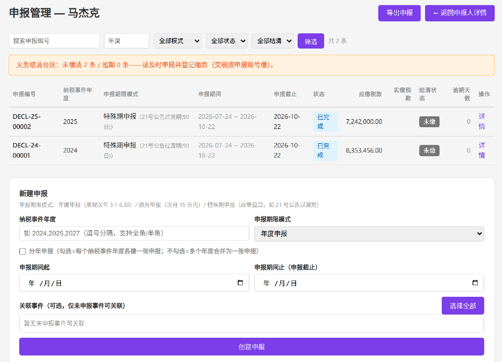

本轮生成了两张申报单：

| 申报编号 | 纳税年度 | 申报期间 | 应缴税款 | 状态 |
|---|---|---|---|---|
| DECL-24-00001 | 2024 | 2026-07-24 ~ 2026-10-22 | 8,353,456.00 | 已申报 |
| DECL-25-00002 | 2025 | 2026-07-24 ~ 2026-10-22 | 7,242,000.00 | 已申报 |

点开任一张（下图是 DECL-25-00002，2025 年那张）可以看到申报明细（事件级）与流转日志：

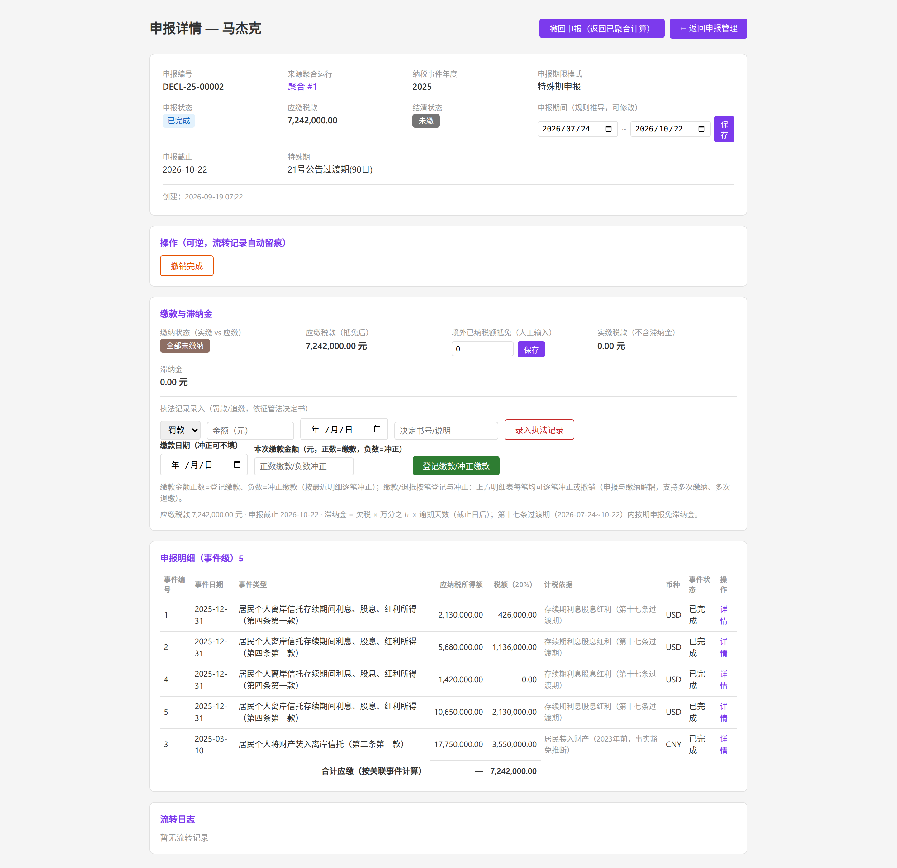

申报明细（事件级）表格里的「**计税依据**」列会写明每条事件命中的规则，
例如「存续期利息股息红利（第十七条过渡期）」「居民装入财产（2023 年前，事实豁免推断）」：

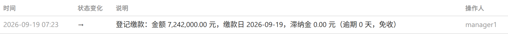

---

## 14. 第十三步：登记缴款

1. 在申报单详情页滚到「**缴纳四态**」区域；
2. 填**缴款日期**（如 2026-09-19）与**本次缴款金额**（正数=缴款，负数=冲正）；
3. 点「**登记缴款/冲正缴款**」，确认后系统写入缴款明细并同步申报汇总：

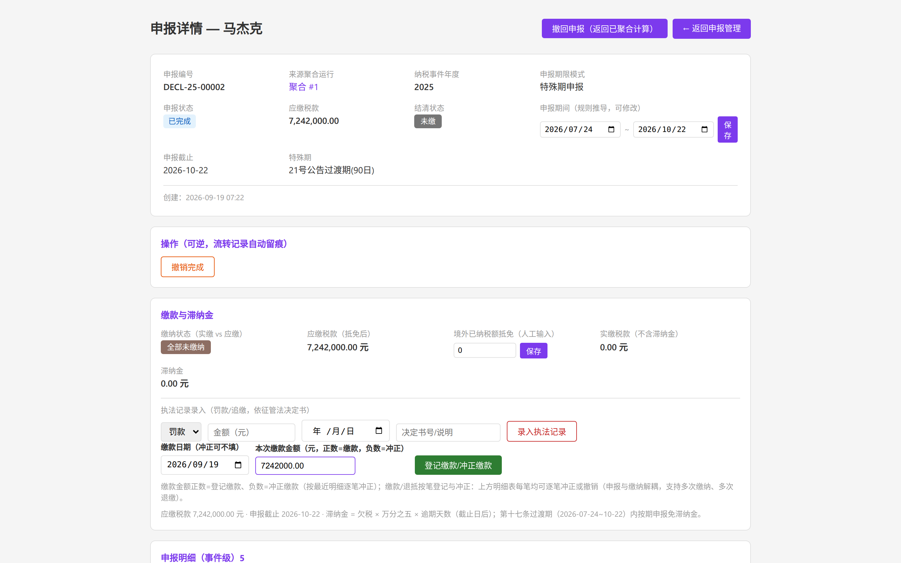

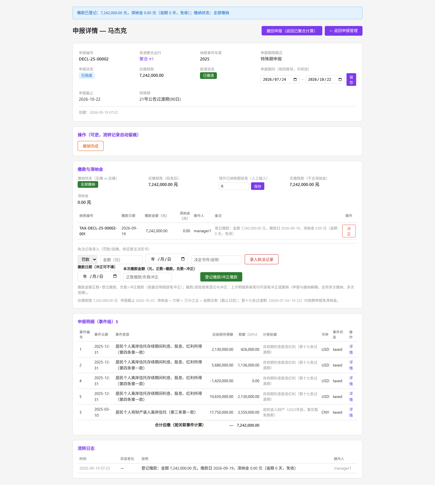

提示示例：

> 缴款已登记：8,353,456.00 元，滞纳金 0.00 元（逾期 0 天，免收）；缴纳状态：全部缴纳

本文示例先缴 2025 年那张 **7,242,000.00 元**（上方两张截图就是它），
再对 2024 年那张重复一次 **8,353,456.00 元**，两张都变成「全部缴纳」。

滞纳金规则：欠税 × 万分之五 × 逾期天数（截止日后）；21 号公告第十七条过渡期
（2026-07-24 ~ 2026-10-22）内按期申报免滞纳金——所以本轮滞纳金为 0。

> 也可以不打开申报单详情：在**申报人详情页**的「**缴纳税款**」区域，
> 每张申报单同一行就能填「本次缴款金额/缴款时间」并点按钮登记（该区与申报单详情页同源）。

---

## 15. 第十四步：台账、文档库与归档

### 15.1 缴款管理台账

门面 → **缴款管理**（<http://127.0.0.1:6080/payments>）。
默认只看「未结清」，所以缴清后这里会显示「共 0 条」——把筛选切到
「**全部（含已缴清）**」再点「筛选」，就能看到两条已缴清记录：

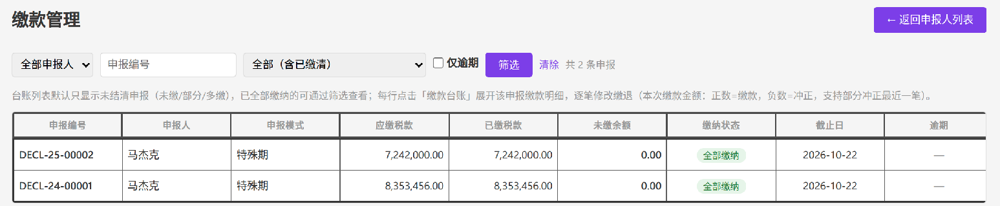

每行右侧「缴款台账」可展开逐笔明细，支持：

- 再次登记缴款（部分缴纳）；
- 输入负数**部分冲正**最近一笔；
- 多缴时办理「退抵」（退税 / 抵减未来应缴）。

### 15.2 文档库

门面或申报人详情页 → **文档库**（<http://127.0.0.1:6080/attachments/library>）：
同一份内容（MD5）只存一份，显示引用情况与「已被事件引用」状态：

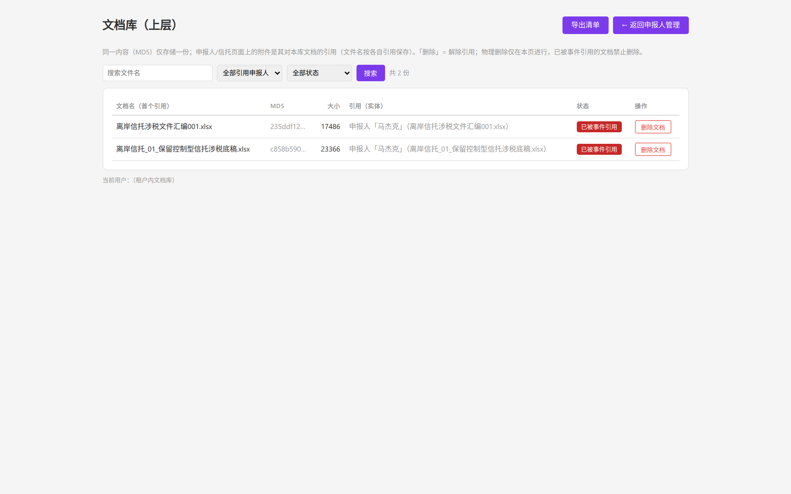

### 15.3 导出与归档

申报人详情页顶部一排按钮即全部导出入口：

| 按钮 | 导出内容 |
|---|---|
| 导出事件列表 | 事件级明细（含原币、汇率、应纳税所得额、税额、状态） |
| 导出变更日志 | 事件状态流转审计日志 |
| 导出档案 | 归档包（申报 + 事件 + 日志） |
| 导出草稿 | 尚未审核的草稿（Excel） |
| 导出汇总台账 / 导出逾期待办 | 申报人列表页的全局导出 |

---

## 16. 一步一图速查表

| 序号 | 步骤 | 截图 |
|---|---|---|
| 1 | 登录页 | `imgs/step01-login.png` |
| 2 | Master 门禁 | `imgs/step02-master-gate.png` |
| 3 | 数据库管理页 | `imgs/step03-master-db-list.png` |
| 4 | 建库表单 | `imgs/step04-create-db.png` |
| 5 | 建库后登录页 | `imgs/step05-portal-after-create.png` |
| 6 | 应用门面 | `imgs/step06-dashboard.png` |
| 7 | 用户管理 | `imgs/step07-user-manage.png` |
| 8 | 新增专员 | `imgs/step08-add-clerk.png` |
| 9 | 新增主管 | `imgs/step09-add-manager.png` |
| 10 | 用户列表 | `imgs/step10-users-list.png` |
| 11 | 创建申报人表单 | `imgs/step11-person-new-form.png` |
| 12 | 表单填写完成 | `imgs/step12-person-new-filled.png` |
| 13 | 申报人列表 | `imgs/step13-person-detail-empty.png` |
| 14 | 申报人详情（空态） | `imgs/step14-person-detail.png` |
| 15 | 附件区 | `imgs/step15b-attachment-panel.png` |
| 16 | 勾选附件批量解析 | `imgs/step16-attachments-selected.png` |
| 17 | 解析中 | `imgs/step17-ai-job-running.png` |
| 18 | 解析完成 | `imgs/step18-ai-job-done.png` |
| 19 | 汇率管理（空） | `imgs/step20-fx-empty.png` |
| 20 | 汇率填写 | `imgs/step21-fx-form-filled.png` |
| 21 | 汇率登记结果 | `imgs/step22-fx-list.png` |
| 22 | 草稿区（含 ⚠ 标记） | `imgs/step25-drafts-flags.png` |
| 23 | AI 预览页核对 | `imgs/step26-ai-preview-check.png` |
| 24 | 保存草稿 | `imgs/step27-draft-saved.png` |
| 25 | 批量审核被拦截 | `imgs/step28-flag-block.png` |
| 26 | 事件详情（草稿态） | `imgs/step29-event-detail-draft.png` |
| 27 | 审核后事件详情 | `imgs/step30-event-approved.png` |
| 28 | 批量审核无标记草稿 | `imgs/step31-select-clean.png` |
| 29 | 审核完成 | `imgs/step32-after-review.png` |
| 30 | 事件列表（8 条） | `imgs/step36b-event-list.png` |
| 31 | 聚合计算预览区 | `imgs/step33-aggregate-area.png` |
| 32 | 聚合结果 | `imgs/step34b-aggregate-panel.png` |
| 33 | 勾选拟生成申报 | `imgs/step35-declare-select.png` |
| 34 | 申报单列表 | `imgs/step37-declarations.png` |
| 35 | 申报单详情 | `imgs/step38-declaration-detail.png` |
| 36 | 登记缴款 | `imgs/step39-pay-form.png` |
| 37 | 缴款成功 | `imgs/step40-paid.png` |
| 38 | 缴款台账 | `imgs/step41-payments-ledger.png` |
| 39 | 文档库 | `imgs/step42-doc-library.png` |

---

## 17. 常见问题（FAQ）

**Q1 登录提示「账号不存在」？**
账号栏要填**邮箱**：`admin`、`clerk1@demo.local`、`manager1@demo.local`。

**Q2 草稿里外币金额是空的／税额是 0？**
没登记汇率。到「汇率管理」按**事件日期 + 币种**登记后，用附件行的
「AI 重新解析」重新解析（单附件按钮；批量解析会跳过已解析过的附件，
以免重复累积草稿）。

**Q3 点「审核选定事件」被拦？**
选中的草稿里有带 `_ai_flags` 的（AI 推测/缺失字段）。按提示的事件编号
逐条打开事件详情页审核，或只勾选没有 ⚠ 的草稿批量审核。

**Q4 上传附件时提示「内容相同，已跳过」？**
文档库按 MD5 去重：同一份内容只存一份，重复上传只会增加一次「引用」。

**Q5缴款后台账看不到记录？**
缴款管理默认筛选「未结清」；缴清后切到「全部（含已缴清）」。

**Q6 金额显示不整齐？**
系统统一「千位分隔 + 两位小数 + 负号紧贴数字」（如 `-1,420,000.00`），
这是显示规范，不影响计算。

---

## 18. 附录：本轮对账表

### 18.1 环境与账号

暂不显示

### 18.2 事件级结果（8 条，全部已申报并缴清）

| 事件编号 | 事件类型 | 事件日期 | 币种 | 原币金额 | 汇率 | 应纳税所得额 | 税额 |
|---|---|---|---|---|---|---|---|
| 9 | 居民个人将财产装入离岸信托 | 2024-06-15 | CNY | — | — | 29,700,000.00 | 5,940,000.00 |
| 10 | 存续期利息股息红利 | 2024-12-31 | USD | 1,200,000.00 | 7.0984 | 8,518,080.00 | 1,703,616.00 |
| 11 | 存续期利息股息红利 | 2024-12-31 | USD | 500,000.00 | 7.0984 | 3,549,200.00 | 709,840.00 |
| 12 | 存续期利息股息红利 | 2025-12-31 | USD | 1,500,000.00 | 7.10 | 10,650,000.00 | 2,130,000.00 |
| 13 | 存续期利息股息红利 | 2025-12-31 | USD | −200,000.00 | 7.10 | −1,420,000.00 | 0.00 |
| 14 | 居民个人将财产装入离岸信托 | 2025-03-10 | CNY | — | — | 17,750,000.00 | 3,550,000.00 |
| 15 | 存续期利息股息红利 | 2025-12-31 | USD | 800,000.00 | 7.10 | 5,680,000.00 | 1,136,000.00 |
| 16 | 存续期利息股息红利 | 2025-12-31 | USD | 300,000.00 | 7.10 | 2,130,000.00 | 426,000.00 |

> 注：事件 9 / 14 属「装入（视同财产转让）」，按「公允价 − 财产原值 − 合理费用」×20% 计算；
> 事件 13 为亏损，应纳税所得额为负、税额为 0（未实现亏损不抵减其他所得）。

### 18.3 申报与缴款结果

| 申报编号 | 年度 | 申报期间 | 应缴 | 已缴 | 状态 |
|---|---|---|---|---|---|
| DECL-24-00001 | 2024 | 2026-07-24 ~ 2026-10-22 | 8,353,456.00 | 8,353,456.00 | 全部缴纳 |
| DECL-25-00002 | 2025 | 2026-07-24 ~ 2026-10-22 | 7,242,000.00 | 7,242,000.00 | 全部缴纳 |
| **合计** | | | **15,595,456.00** | **15,595,456.00** | |

### 18.4 附件来源数据（两份底稿讲了什么）

**附件 A《离岸信托_01_保留控制型信托涉税底稿.xlsx》— Aurora Family Trust**

- BVI VISTA 保留权力型全权信托，2025-03-10 设立，委托人马杰克（中国税收居民，兼任保护人）；
- 装入：现金 USD 300 万 + BVI HoldCo 100% 股权（公允价 2600 万元、原值 800 万元、合理费用 25 万元）；
- 收益：2025 年分红 80 万美元（未分配）、2025 年资本利得 30 万美元（未分配）、
  2026 年分红 95 万美元（其中 30 万美元已分配给受益人）、2026 年资本亏损 10 万美元。

**附件 B《离岸信托涉税文件汇编001.xlsx》— Horizon Family Trust**

- 2024-06-15 设立；
- 装入：现金 USD 500 万 + 科技公司 15% 非上市股权（公允价 4500 万元、原值 1500 万元、费用 30 万元）；
- 收益：2024 年分红 120 万美元、2024 年资本利得 50 万美元、
  2025 年分红 150 万美元、2025 年亏损 20 万美元。

---

**文档版本**：2026-09-19 实测版（示例库 `gaas_demo`，服务 `http://127.0.0.1:6080`）
**截图目录**：`docs/imgs/`（共 41 张，全部由 codex + deepseek-4.1-flash 驱动 Playwright + 系统 Chrome  实拍）
